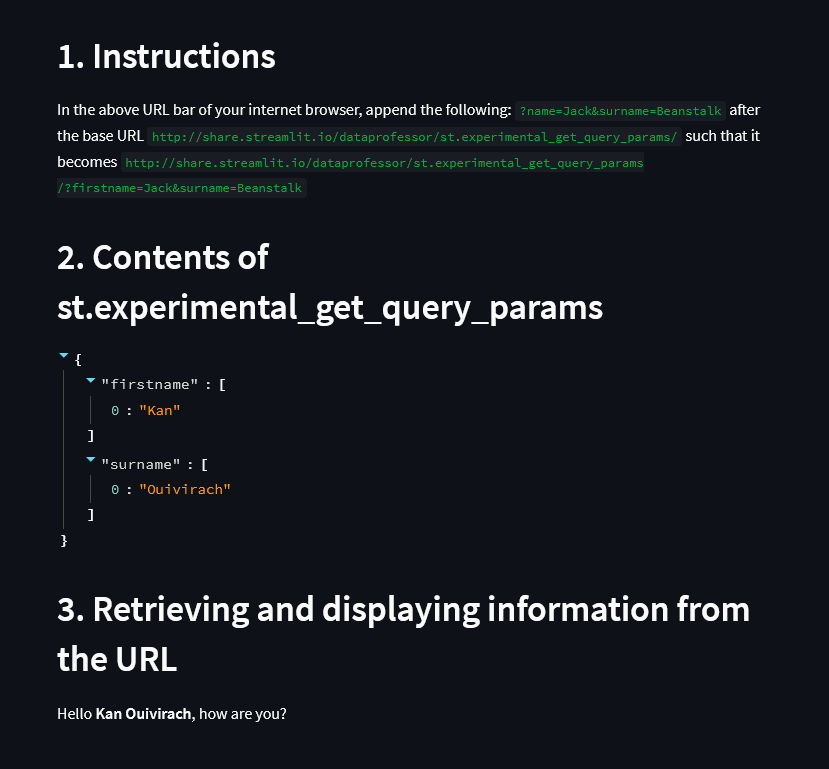

# st.experimental_get_query_params

Allow the retrieval of query parameters directly from the URL of the user's
browser.

```sh
streamlit run app.py
```

Test with this URL below:

http://localhost:8501/?firstname=Kan&surname=Ouivirach

Here is the result:


