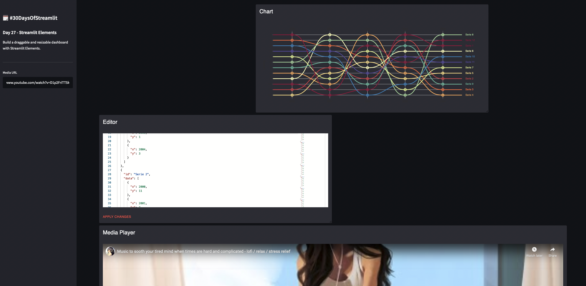

# Build a draggable and resizable dashboard with Streamlit Elements

Play with Streamlit Elements to create a dashboard composed of Material UI cards.

```sh
streamlit run app.py
```

Here is the result:


