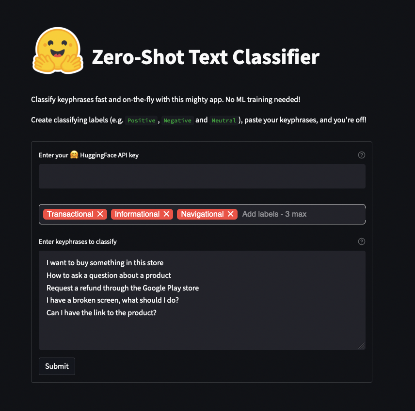

# How to make a zero-shot learning text classifier using Hugging Face and Streamlit

Create a zero-shot learning text classifier using Hugging Face's API inference
and Distilbart!

[See the full blog](https://www.charlywargnier.com/post/how-to-create-a-zero-shot-learning-text-classifier-using-hugging-face-and-streamlit)

```sh
streamlit run app.py
```

Here is the resutl:


